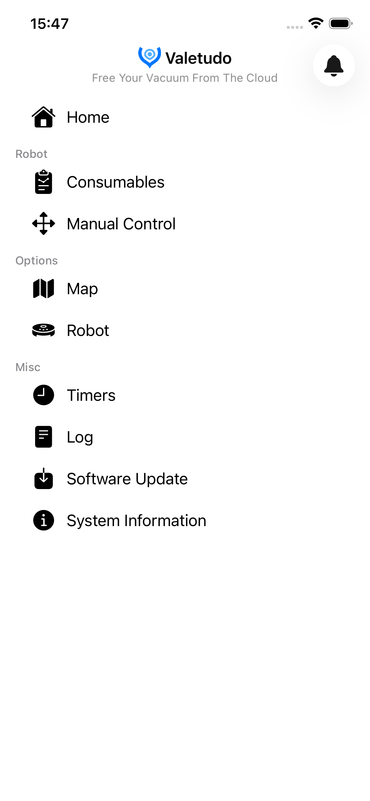
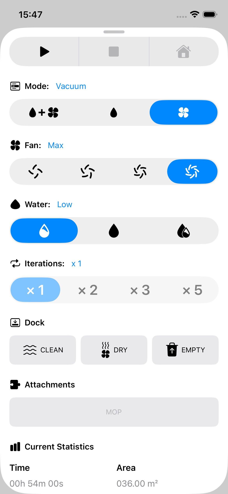
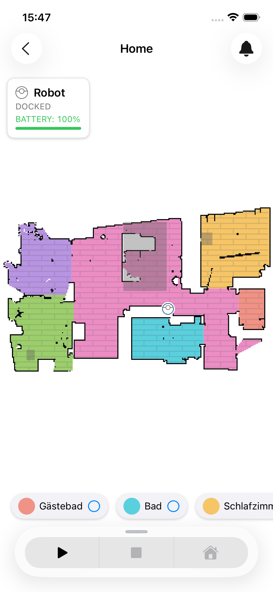
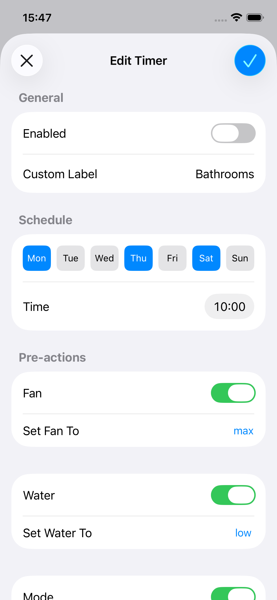
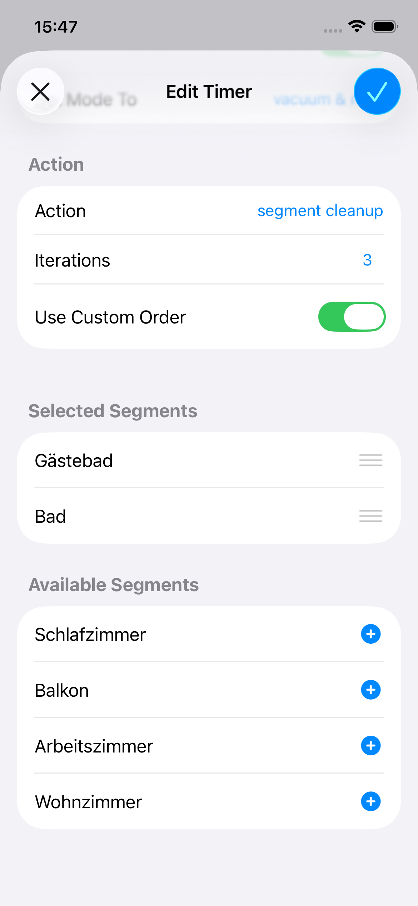
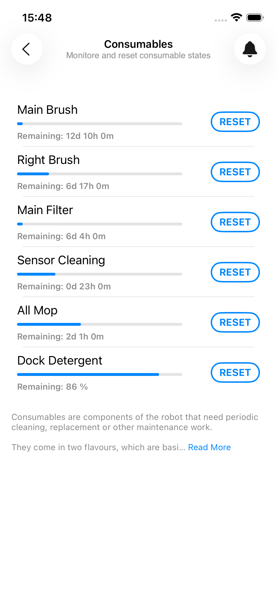
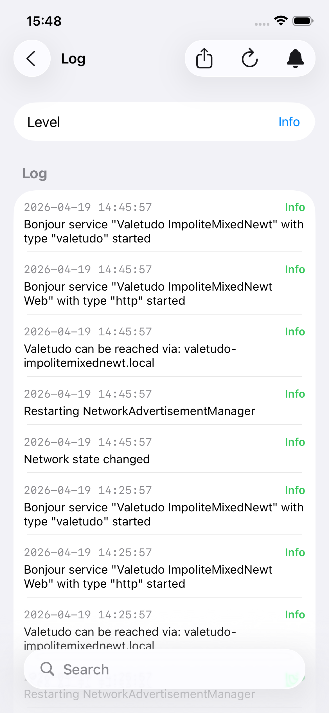
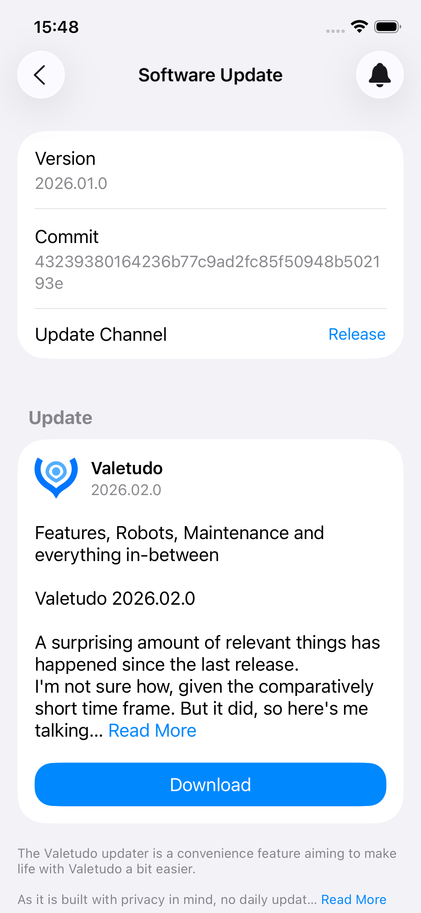
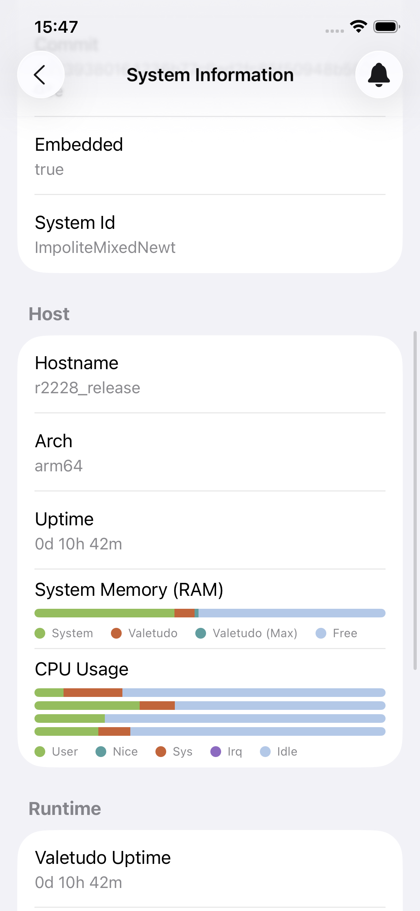

# Valetudo-iOS

⚠️ **This project is not officially affiliated with the [Valetudo](https://github.com/Hypfer/Valetudo) project.**

This repository contains an iOS client for Valetudo, built unapologetically with UIKit rather than SwiftUI.

---

## What is Valetudo?

[Valetudo](https://github.com/Hypfer/Valetudo) is an open-source replacement firmware for robot vacuum cleaners that prevents them from communicating with external cloud servers.

It achieves this by redirecting DNS requests to localhost, allowing it to run a local server with a REST API directly on the robot. The robot then advertises itself via [Bonjour](https://en.wikipedia.org/wiki/Bonjour_(software)), enabling client applications to discover and communicate with it over the local network.

## What is this project?

This project implements such a native iOS client for Valetudo.

It is currently a work in progress (for example, the robot URL is still hardcoded), but many features are already supported, including:

- Map with rooms (Floor material, carpets...)
- Cleaning controls (Fan Speed, Water Control, Iterations...)
- Timer configuration  
- View Logs   
- Manual control (remote driving)  
- Software updates  
- System information  

The long-term goal is to support all features available in the official Valetudo web interface and also support iPadOS, MacOS and maybe watchOS. 

## Screenshots

| | | |
|---|---|---|
|  |  |  |
|  |  |  |
|  |  |  |

## Why UIKit and not SwiftUI?

SwiftUI is great and allows you to build interfaces quickly, but in practice it often gets you about 80% of the way. For the remaining 20%, you frequently have to drop down to UIKit (or AppKit) to achieve full control or fix edge cases.

For more complex applications, I find using UIKit directly more predictable, easier and flexible.

Also, in the age of LLMs, boilerplate code is far less of a concern than it used to be. Avoiding UIKit purely for that is not a good excuse anymore.

## License

This project is licensed under the GNU General Public License v3.0 (GPLv3).

**Note that I did not include an App Store exception on purpose. As a result, distribution of this application via the Apple App Store is not permitted!**

An official App Store release may be provided by me once the application reaches a suitable level of completeness and stability.